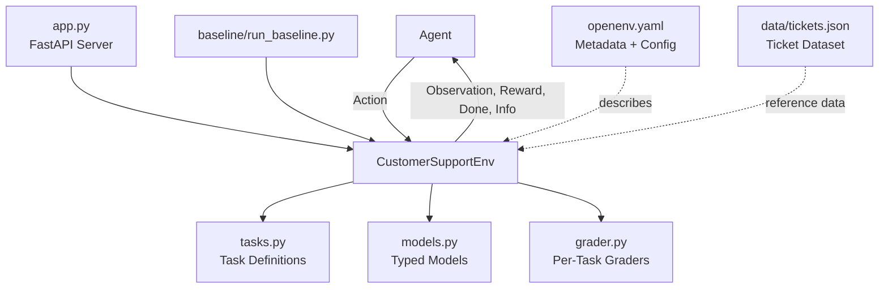
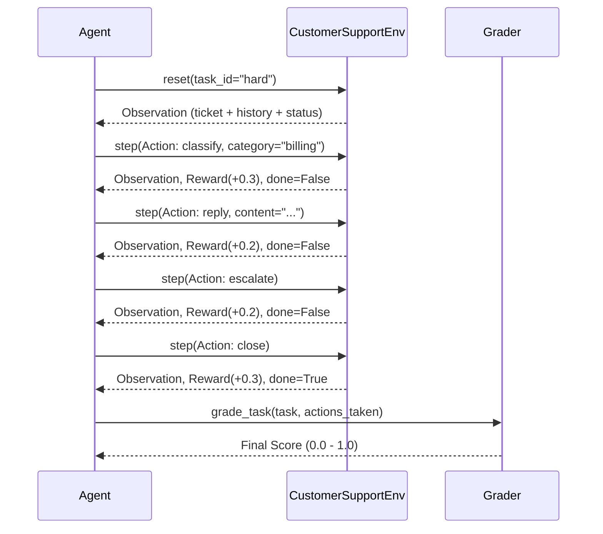
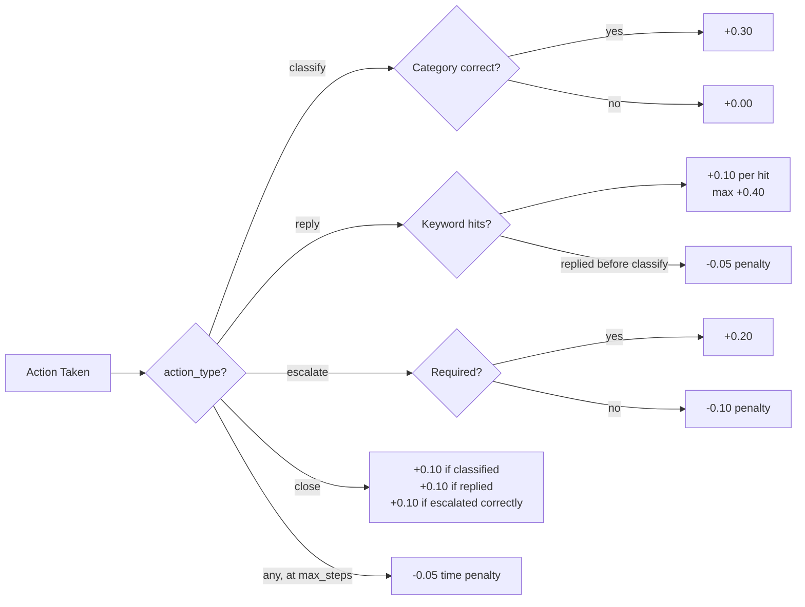
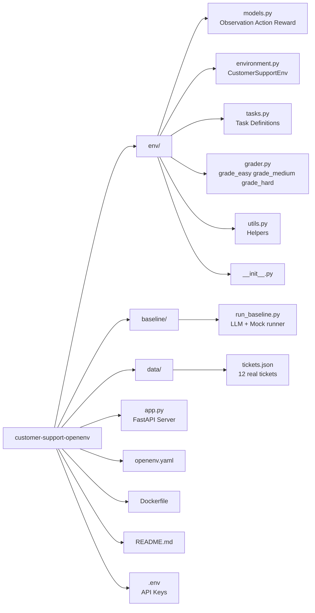

# Customer Support OpenEnv

> A real-world reinforcement learning environment where an AI agent learns to handle customer support tickets — classify issues, craft replies, escalate when needed, and resolve tickets.


---

## What is this?

Most RL environments are games. This one is not.

Every company with customers has a support queue. Tickets come in — billing complaints, app crashes, refund requests, angry users threatening legal action. A human agent reads each one, figures out what's wrong, replies helpfully, escalates if it's too serious, and closes it.

This environment teaches an AI to do exactly that. The agent receives a ticket, takes actions step by step, and gets rewarded based on how well it handles the situation. The reward signal is **dense** — the agent gets feedback at every step, not just at the end.

---

## Architecture

### Overall System



### Episode Flow



### Reward Breakdown



### File Structure



---

## Tasks

The environment has 3 tasks of increasing difficulty. An agent must handle all three.

| Task | Difficulty | Max Steps | What the agent must do |
|---|---|---|---|
| `easy` | 🟢 Easy | 5 | Just classify the ticket correctly |
| `medium` | 🟡 Medium | 8 | Classify + give a helpful reply |
| `hard` | 🔴 Hard | 10 | Classify → reply → escalate → close |

### Easy — Classification Only
```
Customer: "I was charged twice for my order and need the duplicate removed."
Agent must → classify as "billing"
Score: 1.0 correct, 0.0 wrong
```

### Medium — Classify + Reply
```
Customer: "The app keeps crashing on my iPhone. I already restarted twice."
Agent must → classify as "technical" AND reply with relevant keywords
Score: 0.4 (classify) + up to 0.6 (reply quality)
```

### Hard — Full Pipeline
```
Customer: "Been waiting 3 weeks for my refund. Considering legal action."
History: 4 prior messages showing escalation attempts
Agent must → classify + reply + escalate to human + close ticket
Score: 0.2 + 0.3 + 0.2 + 0.3 (partial credit, penalty for bad escalation)
```

---

## Observation Space

What the agent sees at each step:

```python
Observation(
    ticket_id="T001",
    customer_query="I was charged twice and need a refund.",
    history=["Agent: We are looking into it.", "Customer: Still waiting!"],
    status="pending"   # open | pending | resolved
)
```

---

## Action Space

What the agent can do:

```python
Action(action_type="classify", category="billing")          # identify the issue
Action(action_type="reply",    content="We will help...")   # respond to customer
Action(action_type="escalate")                              # pass to human agent
Action(action_type="close")                                 # end the episode
```

Valid categories: `billing` | `technical` | `refund` | `account` | `abuse`

---

## Setup

### 1. Clone and install

```bash
git clone <your-repo-url>
cd customer-support-openenv
pip install -r requirements.txt
```

### 2. Configure required inference environment variables

```bash
# .env (required by inference.py for Meta Phase 1 evaluation)
API_BASE_URL=https://your-llm-endpoint/v1
MODEL_NAME=your-model-id
HF_TOKEN=your-api-token
```

`inference.py` uses the OpenAI Python client and reads only the variables above.

### 3. Run the baseline

```bash
python baseline/run_baseline.py
```

If those variables are not set, the baseline/mock policy still runs deterministic actions so script execution remains reproducible.

### 4. Start the HTTP server

```bash
python app.py
# → http://localhost:7860
```

### 5. Try it manually

```bash
# Start a hard task episode
curl "http://localhost:7860/reset?task_id=hard"

# Classify the ticket
curl -X POST http://localhost:7860/step \
  -H "Content-Type: application/json" \
  -d '{"action_type": "classify", "category": "billing"}'

# Reply
curl -X POST http://localhost:7860/step \
  -H "Content-Type: application/json" \
  -d '{"action_type": "reply", "content": "We are escalating your refund as priority."}'

# Escalate
curl -X POST http://localhost:7860/step \
  -H "Content-Type: application/json" \
  -d '{"action_type": "escalate"}'

# Close
curl -X POST http://localhost:7860/step \
  -H "Content-Type: application/json" \
  -d '{"action_type": "close"}'
```

### 6. Use directly in Python

```python
from env import CustomerSupportEnv, Action

env = CustomerSupportEnv()
obs = env.reset(task_id="hard")

print(obs.customer_query)
# → "I have been waiting three weeks for a refund..."

obs, reward, done, info = env.step(Action(action_type="classify", category="billing"))
print(reward.score, reward.feedback)
# → 0.3  "correct category"

obs, reward, done, info = env.step(Action(
    action_type="reply",
    content="We are making this a priority refund and escalating to a manager."
))

obs, reward, done, info = env.step(Action(action_type="escalate"))
obs, reward, done, info = env.step(Action(action_type="close"))
```

---

## Docker

```bash
docker build -t openenv .
docker run -p 7860:7860 \
  -e API_BASE_URL=https://your-llm-endpoint/v1 \
  -e MODEL_NAME=your-model-id \
  -e HF_TOKEN=your-api-token \
  openenv
```

---

## Deploying to Hugging Face Spaces

1. Go to [huggingface.co/spaces](https://huggingface.co/spaces)
2. Create a new Space → select **Docker** SDK
3. Add tag: `openenv`
4. Upload this entire repo
5. Add these Space secrets:
   - `API_BASE_URL`
   - `MODEL_NAME`
   - `HF_TOKEN`

The server starts automatically and exposes all endpoints.

---

## Baseline Scores

Measured with deterministic mock actions (no API key needed):

| Task | Mock Score | LLM Score (gpt-4o-mini) |
|---|---|---|
| easy | 1.000 | ~0.900 |
| medium | 0.850 | ~0.750 |
| hard | 0.775 | ~0.650 |
| **Total** | **2.625 / 3.0** | **~2.300 / 3.0** |

---

## API Reference

| Method | Endpoint | Description |
|---|---|---|
| GET | `/` | HTML landing page |
| POST | `/reset` | Start/reset episode (validator-compatible) |
| GET | `/reset?task_id=easy` | Start a new episode |
| POST | `/step` | Submit an Action |
| GET | `/state` | Current raw state |
| POST | `/state` | Current raw state (compatibility route) |
| GET | `/tasks` | List all tasks |
| POST | `/tasks` | List all tasks (compatibility route) |
| GET | `/health` | Health check |
| GET | `/docs` | Swagger UI |

---

## Team

- **Adit Sharma** — adit.2428cs1345@kiet.edu
- **Mansi Verma** — ogmansi897@gmail.com
- **Priyanshi Vishwakarma** — vishwakarmapriyanshi68@gmail.com

---

*Meta × PyTorch OpenEnv Hackathon — Round 1, April 2026*
